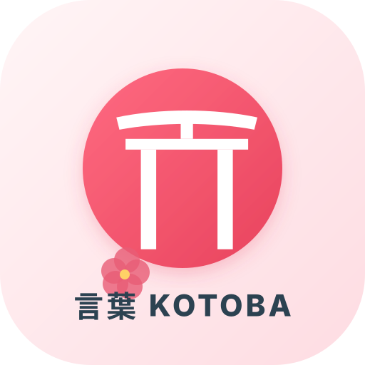

# Kotoba (言葉) — Application d'Apprentissage du Japonais

Une application moderne, simple et rapide pour apprendre le japonais en famille sur **iPhone, iPad et Mac**, hébergée gratuitement sur **GitHub Pages**.

---

## ✨ Fonctionnalités Principales

- **🈴 Maîtrise des Kana (Hiragana & Katakana)** :
  - Grilles complètes avec audio haute fidélité (`ja-JP`).
  - Sons de base (46 Gojūon), sons voisés (Dakuon/Handakuon) et combinaisons (Yōon).
  - Mnémoniques visuels en français et en anglais.
- **🗣️ Prononciation Japonaise Intégrée** :
  - Synthèse vocale japonaise native (Web Speech API) sans aucune clé API requise.
  - Vitesse d'élocution réglable : Normale ou Lente (pour débutants).
- **📖 Vocabulaire Thématique de Survie** :
  - Salutations, Chiffres & Prix, Nourriture & Restaurant, Voyage & Transports, Famille & Quotidien, Phrases indispensables.
  - Écritures en Kanji avec **Furigana** (lecture au-dessus) et Romaji.
- **🎯 4 Modes d'Entraînement** :
  - **Cartes Mémoire (Flashcards 3D)** : Retournez la carte, écoutez l'audio et validez vos acquis.
  - **Quiz Choix Multiple** : 10 questions rapides avec score immédiat.
  - **Quiz Écoute & Audio** : Entraînez votre oreille aux sons japonais naturels.
  - **Défi Vitesse 60s** : Une minute chrono pour battre le record de la famille !
- **👨‍👩‍👧‍👦 Conçu pour la Famille & Partage** :
  - Sélecteur de profils d'apprenants (ex: *Moi, Nils, Elle, Papa, Maman*).
  - Suivi des séries (streaks quotidiens), kana maîtrisés et scores séparés par profil.
  - Sauvegarde et transfert faciles en un clic (Export JSON).
- **📱 PWA 100% Hors-Ligne** :
  - Fonctionne même dans l'avion ou sans connexion internet grâce au Service Worker.
  - S'installe directement sur l'écran d'accueil de l'iPhone comme une vraie application native (plein écran sans barre de navigation).

---
